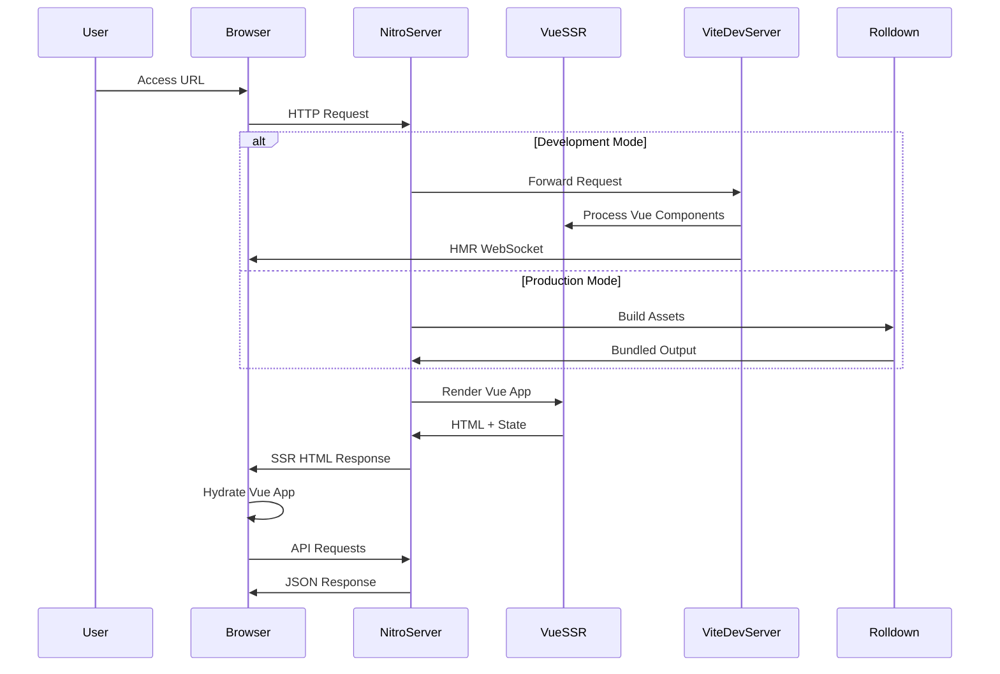
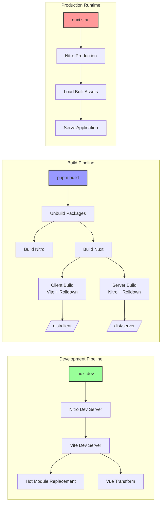

client 側もビルドして vue が動くようにする

## アーキテクチャ

```mermaid
graph TB
    subgraph "Workspace Structure"
        Root[chibinuxt<br/>pnpm workspace]
        Root --> Packages[packages/]
        Root --> Playground[playground/]
    end

    subgraph "Core Packages"
        Packages --> Nitro[nitro<br/>Server Framework]
        Packages --> Nuxt[nuxt<br/>Vue Framework]
    end

    subgraph "Nitro Package Architecture"
        Nitro --> NitroCore[core/<br/>Build & Config]
        Nitro --> NitroKit[kit/<br/>Utilities]
        Nitro --> NitroPresets[presets/<br/>Deploy Targets]
        Nitro --> NitroRolldown[rolldown/<br/>Bundler Integration]
        Nitro --> NitroRuntime[runtime/<br/>Server Runtime]
        Nitro --> NitroTypes[types/<br/>Type Definitions]

        NitroCore --> DevServer[dev-server/<br/>Development Server]
        NitroCore --> BuildSystem[build/<br/>Build Pipeline]
        NitroCore --> ConfigLoader[config/<br/>Configuration Loader]

        NitroRolldown --> RolldownConfig[config.ts<br/>Rolldown Config]
        NitroRolldown --> VirtualPlugin[plugins/virtual.ts<br/>Virtual Modules]
    end

    subgraph "Nuxt Package Architecture"
        Nuxt --> NuxtApp[app/<br/>Client Entry Points]
        Nuxt --> NuxtCore[core/<br/>Nuxt Core]
        Nuxt --> NuxtVite[vite/<br/>Vite Integration]

        NuxtApp --> ClientEntry[entry.client.ts<br/>Browser Entry]
        NuxtApp --> ServerEntry[entry.server.ts<br/>SSR Entry]
        NuxtApp --> RouterPlugin[plugins/router.ts<br/>Vue Router]

        NuxtCore --> NuxtNitro[nitro.ts<br/>Nitro Integration]
        NuxtCore --> NuxtMain[nuxt.ts<br/>Main Logic]
        NuxtCore --> Renderer[runtime/nitro/renderer.ts<br/>Vue SSR Renderer]
    end

    subgraph "Playground Application"
        Playground --> AppVue[App.vue<br/>Root Component]
        Playground --> Pages[pages/<br/>Route Components]
        Pages --> HelloPage[hello.vue]
        Pages --> WorldPage[world.vue]
    end

    subgraph "Dependencies & Build Tools"
        Nitro --> Rolldown[rolldown<br/>Next-gen Bundler]
        Nitro --> H3[h3<br/>HTTP Framework]
        Nitro --> Unenv[unenv<br/>Universal Env]
        Nitro --> C12[c12<br/>Config Loader]

        Nuxt --> Vite[vite<br/>Dev Server & Builder]
        Nuxt --> VuePlugin[vitejs/plugin-vue<br/>Vue Support]
        Nuxt --> VueRouter[vue-router<br/>Client Routing]

        Both[Both Packages] --> Vue[vue<br/>UI Framework]
        Both --> VueBundleRenderer[vue-bundle-renderer<br/>SSR Renderer]
    end

    subgraph "Build Flow"
        BuildCmd[pnpm build] --> Unbuild[unbuild<br/>Package Builder]
        Unbuild --> NitroDist[nitro/dist/]
        Unbuild --> NuxtDist[nuxt/dist/]

        NuxtDist --> PlaygroundBuild[Playground Build]
        PlaygroundBuild --> ClientBundle[Client Bundle<br/>Browser Assets]
        PlaygroundBuild --> ServerBundle[Server Bundle<br/>SSR Handler]
    end

    style Root fill:#f9f,stroke:#333,stroke-width:4px
    style Nitro fill:#bbf,stroke:#333,stroke-width:2px
    style Nuxt fill:#bfb,stroke:#333,stroke-width:2px
    style Playground fill:#fbf,stroke:#333,stroke-width:2px
    style Rolldown fill:#ff9,stroke:#333,stroke-width:2px
    style Vite fill:#f9f,stroke:#333,stroke-width:2px
    style Vue fill:#4fc08d,stroke:#333,stroke-width:2px
```

## データフロー

```mermaid
sequenceDiagram
    participant User
    participant Browser
    participant NitroServer
    participant VueSSR
    participant ViteDevServer
    participant Rolldown

    User->>Browser: Access URL
    Browser->>NitroServer: HTTP Request

    alt Development Mode
        NitroServer->>ViteDevServer: Forward Request
        ViteDevServer->>VueSSR: Process Vue Components
        ViteDevServer->>Browser: HMR WebSocket
    else Production Mode
        NitroServer->>Rolldown: Build Assets
        Rolldown->>NitroServer: Bundled Output
    end

    NitroServer->>VueSSR: Render Vue App
    VueSSR->>NitroServer: HTML + State
    NitroServer->>Browser: SSR HTML Response
    Browser->>Browser: Hydrate Vue App
    Browser->>NitroServer: API Requests
    NitroServer->>Browser: JSON Response
```

## ビルドパイプライン

```mermaid
graph LR
    subgraph "Development Pipeline"
        DevStart[nuxi dev] --> NitroDevServer[Nitro Dev Server]
        NitroDevServer --> ViteDev[Vite Dev Server]
        ViteDev --> HMR[Hot Module Replacement]
        ViteDev --> VueTransform[Vue Transform]
    end

    subgraph "Build Pipeline"
        BuildStart[pnpm build] --> UnbuildPhase[Unbuild Packages]
        UnbuildPhase --> NitroBuild[Build Nitro]
        UnbuildPhase --> NuxtBuild[Build Nuxt]

        NuxtBuild --> ClientBuild[Client Build<br/>Vite + Rolldown]
        NuxtBuild --> ServerBuild[Server Build<br/>Nitro + Rolldown]

        ClientBuild --> ClientAssets[/dist/client/]
        ServerBuild --> ServerAssets[/dist/server/]
    end

    subgraph "Production Runtime"
        ProdStart[nuxi start] --> NitroProd[Nitro Production]
        NitroProd --> LoadAssets[Load Built Assets]
        LoadAssets --> ServeApp[Serve Application]
    end

    style DevStart fill:#9f9,stroke:#333,stroke-width:2px
    style BuildStart fill:#99f,stroke:#333,stroke-width:2px
    style ProdStart fill:#f99,stroke:#333,stroke-width:2px
```
